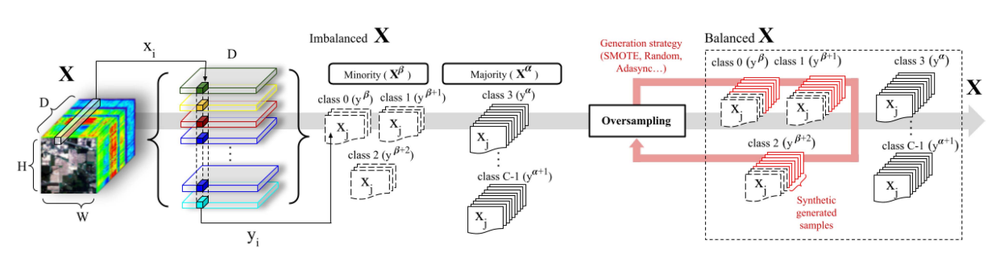

# A Comprehensive Survey of Imbalance Correction Techniques for Hyperspectral Data Classification
The Code for "A Comprehensive Survey of Imbalance Correction Techniques for Hyperspectral Data Classification". [https://ieeexplore.ieee.org/document/10132491]
```
M. E. Paoletti, O. Mogollon-Gutierrez, S. Moreno-Álvarez, J. C. Sancho and J. M. Haut.
A Comprehensive Survey of Imbalance Correction Techniques for Hyperspectral Data Classification
IEEE Journal of Selected Topics in Applied Earth Observations and Remote Sensing
DOI: 10.1109/JSTARS.2023.3279506
June 2023.
```

<p align="center">

</p>

## Run code
```
# Spectral algorithms
cd spectral_algorithms
# without oversampling
python -u mlr.py  --dataset IP --oversampling None --random_state 10 --tr_percent 0.05
# with dimensionality reduction
python -u mlr.py  --dataset IP --oversampling PCA --random_state 10 --tr_percent 0.05
# with oversampling
python -u mlr.py  --dataset $dset --oversampling SMOTE --random_state 10 --tr_percent 0.05

# Spectral-Spatial algorithms
# CNN 3D
cd spectral-spatial_algorithms
python -u cnn3d_gamo_ov.py --dataset IP
# GAMO
git clone https://github.com/mhaut/3D-HyperGAMO/
cd 3D-HyperGAMO
python main.py --dataset IP


# Semantic segmentation
cd semantic-segmentation
# standard training
python -u train.py --network_arch resnet --resnet_blocks 6 --use_cuda --network_weights_path ./resnet6CrossEntropy.pt --lossF "cross-ent"
# Imbalance loss
python -u train.py --network_arch resnet --resnet_blocks 6 --use_cuda --network_weights_path ./resnet6FocalLoss.pt --lossF "focal"
python -u train.py --network_arch resnet --resnet_blocks 6 --use_cuda --network_weights_path ./resnet6AsimetricFocalLoss.pt --lossF "aslfocal"
python -u train.py --network_arch resnet --resnet_blocks 6 --use_cuda --network_weights_path ./resnet6Cyclical.pt --lossF "cfocal"

python -u test.py  --network_arch resnet --resnet_blocks 6 --use_cuda --network_weights_path ./path2model.pt
```


